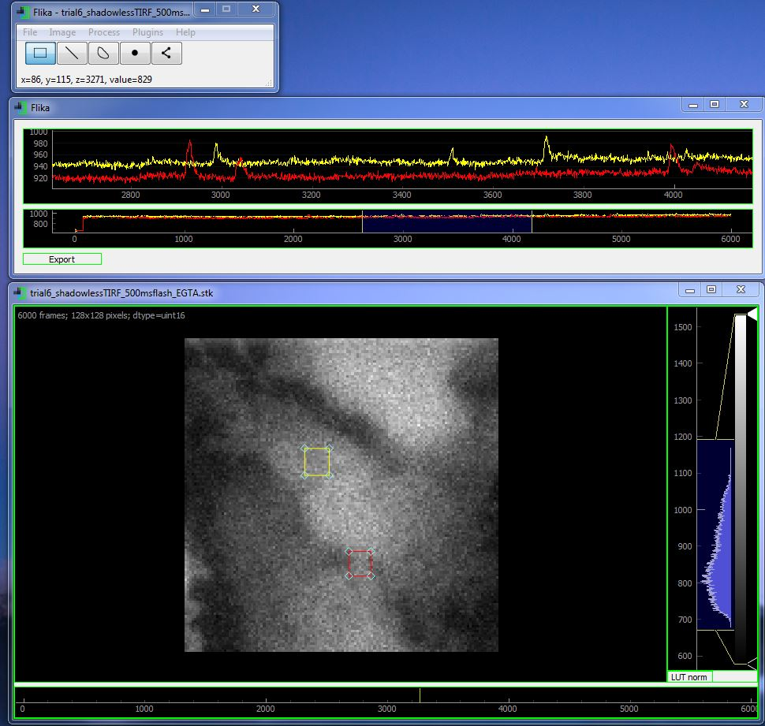

## Flika ##

**Flika** is an interactive image processing program for biologists written in Python.
### Website ###
[flika-org.github.io](http://flika-org.github.io/)

### Documentation ###
[flika-org.github.io/documentation.html](http://flika-org.github.io/documentation.html)



### Installation Instructions ###

#### Windows ####

1. Install Python
 
	Flika requires Python 3 to run. To install Python, go [here](https://www.python.org/downloads/windows/) and download the latest Windows x86-64 MSI installer.  Once the file is downloaded, double click the icon and follow the on-screen instructions.  

2. Install Flika dependencies
	* numpy MKL
	* scipy
	* PyQt4
	* qtpy
	* pyqtgraph
	* scikit-image
	* xmltodict
	* ipython
	* zmq
	* ipykernel
	* qtconsole
	* pyopengl	
	* nd2reader
	* openpyxl
	* matplotlib
	* tifffile
	
	There are many ways you can install these dependencies, but the following is the way we prefer. Once you have installed Python, make a folder on your Desktop called `binary_dependencies`. Go to [Christoph Gohlke's website](http://www.lfd.uci.edu/~gohlke/pythonlibs/) and download the first three dependencies (numpy, scipy, and PyQt4) into the `binary_dependencies` folder. Make sure the computer architecture and python version match yours. For instance, I have Python 3.5 running on a 64 bit computer, so I downloaded `numpy-1.12.0+mkl-cp35-cp35m-win_amd64.whl`, `scipy-0.19.0rc1-cp35-cp35m-win_amd64.whl`, and `PyQt4-4.11.4-cp35-cp35m-win_amd64.whl` into the `binary_dependencies` folder. Once these three files are downloaded, open a command prompt (Start->cmd.exe), navigate to the `binary_dependencies` folder (`cd Desktop\binary_dependencies`) and run the following commands (replacing the numpy, scipy, and PyQt4 file names with your own):
	```
	python -m pip install --upgrade pip
	pip install "numpy-1.12.0+mkl-cp35-cp35m-win_amd64.whl"
	pip install scipy-0.19.0rc1-cp35-cp35m-win_amd64.whl
	pip install PyQt4-4.11.4-cp35-cp35m-win_amd64.whl
	pip install qtpy pyqtgraph scikit-image xmltodict ipython zmq ipykernel qtconsole pyopengl nd2reader tifffile openpyxl
	```

	Now that all of Flika's dependencies are installed you can remove the `binary_dependencies` folder and install Flika. 


3. Install Flika

	Download the [zipped folder](https://github.com/kyleellefsen/Flika/archive/master.zip) from Github and extract the folder to a location on your computer (preferably in ```C:/Program Files/```). After the folder has been extracted, you can run Flika with the command ```python flika.py```. We recommend using the free IDE PyCharm for scripting in Flika. To run Flika in the PyCharm IPython interpreter, run the following command
	```
	import os, sys; flika_dir = my_flika_dir; sys.path.append(flika_dir); from flika import *; start_flika()
	```
	replacing ```my_flika_dir``` with the location of the flika folder.

#### Ubuntu ####
1. Install Python

	Flika requires Python 3 to run. Make sure this is the version of Python you are using.

2. Install Flika dependencies

	Open a terminal and run the following commands:
	```
	sudo apt-get install python-pip python-numpy python-scipy build-essential cython python-matplotlib python-qt4-gl libgeos-c1v5 libgeos-dev
	sudo pip install scikit-image
	```

3. Install Flika

	Download the [zipped folder](https://github.com/kyleellefsen/Flika/archive/master.zip) from Github and extract the folder to a location on your computer.  Navigate to the directory Flika was downloaded into.  Run Flika with the command

	```python flika.py```

#### Mac OSX ####

1. Install Python and Flika Dependencies

	Flika requires Python 3 to run. To install Python along with most of Flika's dependencies, download [Anaconda](https://www.continuum.io/downloads) by Continuum.

2. Install Flika

	Download the [zipped folder](https://github.com/kyleellefsen/Flika/archive/master.zip) from Github and extract the folder to a location on your computer.  Open a terminal (Press command+space, type 'Terminal'). Navigate to the directory Flika was downloaded into.  Run Flika with the command

	```python flika.py```
